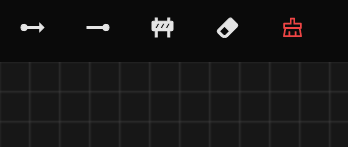
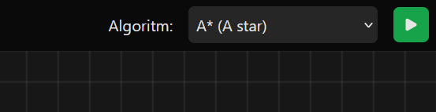
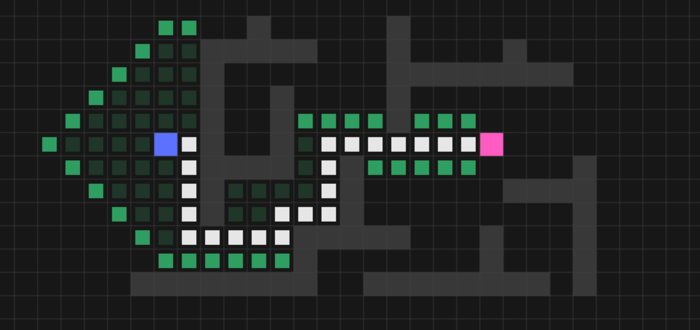
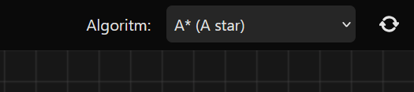

# Pathfinding Visualizer

A React app that visualizes the steps of pathfinding algorithms by utilizing HTML5 canvas.

<a href="https://lubosgarancovsky.github.io/pathfinder/">https://lubosgarancovsky.github.io/pathfinder/</a>

## Drawing

Before running the pathfinding algorithm, you must specify the starting and ending points. You can do that by selecting one of the first two buttons in the top left corner with the arrow icons inside them.

**Buttons**

- Starting point
- Ending point
- Barrier
- Eraser
- Clear

You can also draw obstacles for the algorithm by selecting the "Barrier" tool, or erase your mistakes with the "Eraser," while the red "Clear" button flushes the whole canvas.

## Running Pathfinder

After drawing your maze and setting up starting and ending positions, you can run the selected algorithm by pressing the green "Run" button. Now you can watch the purple tile make its way towards the magenta tile.

## Visualization

Pathfinding is visualized by green and white squares, which are drawn onto the board as the algorithm progresses.

- Dark green -> visited nodes
- Light green -> open set
- White -> path found by the algorithm

After the pathfinder is done, watch out for a little pop-up snackbar that appears in the bottom left corner. It carries information about the length of the path.

## Repeat

After the pathfinding is done, a "New scenario" button appears in place of the "Run" button. By clicking on it, you clear the visualization, but you keep the board layout, so you can run the same scenario again or make slight changes to it.

